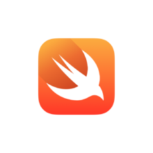

.. Swift 入门 documentation master file, created by
   sphinx-quickstart on Fri Dec  7 13:54:33 2012.
   You can adapt this file completely to your liking, but it should at least
   contain the root `toctree` directive
   github: https://github.com/wangleihd/Swiftcn.git

Swift 入门
===================

:Authors: Richard.Wang

:Version: 1.1 of 2015/06/27

:Dedication: To my Grandmother and my wife.

Swift 是一门新语言, 它是根据这么多种语言进化而来的一门语言. Swift更趋近人们的对自然的认识.

目录
----------------------------

.. toctree::
   :maxdepth: 2

   swift/first

附录:
-----------------------------

.. toctree::
   :maxdepth: 2
 

~~~~~~~~~~~~~~~~~~~~~~~~~~~~~
   

.. warning::

   **声明:**

   这是私人的文档,不能与别人共享.  本文档由 Richard.Wang 撰写，保留所有权利.

   `知识共享许可协议 <http://creativecommons.org/licenses/by-nc-nd/3.0/cn/legalcode>`_
   `<<Swift 入门>> <http://swiftcn.readthedocs.org/>`_ 由 \
   `Richard.Wang <http://swiftcn.readthedocs.org/>`_  创作.

   采用 \ `署名-非商业性使用-禁止演绎 3.0 中国大陆 (CC BY-NC-ND 3.0 CN)
   <http://creativecommons.org/licenses/by-nc-nd/4.0/legalcode>`_  进行许可。

   .. image:: images/license.png
..     :align: center
